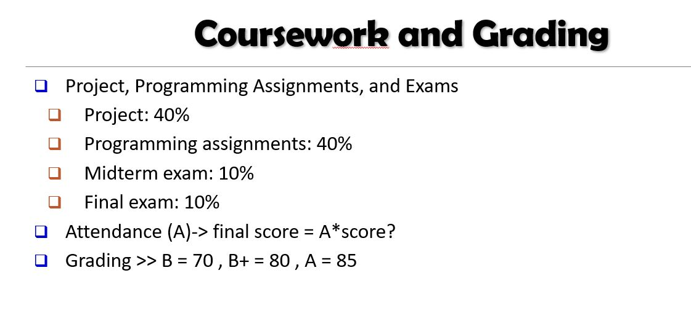

# DPDM2021
Data Processing and Data Mining 2021
## Nichakan Romroeng 645020059-9

------------------------------------------------------------------------------
# Table of contents
==========================================================================
## บทที่ 1 introduction [code](https://github.com/nicha0524/DPDM2021/blob/main/intro.ipynb)
 
## บทที่ 2 Gettig to Know Your data
   ประกอบด้วย 3 เรื่อง คือ
  
   #### 1. Basic pypython [code](https://colab.research.google.com/github/nicha0524/DPDM2021/blob/main/Data101_(chapter2).ipynb#scrollTo=JwfbsPsB0U12) [lecture](https://github.com/nicha0524/DPDM2021/blob/main/%E0%B8%AA%E0%B8%A3%E0%B8%B8%E0%B8%9B%E0%B8%9A%E0%B8%97%E0%B8%97%E0%B8%B5%E0%B9%881.pdf)
         - variable :ข้อกำหนดในการตั้งชื่อตัวแปร
         - Casting :การแปลงชนิดข้อมูล
         - Data structure :โครงสร้างข้อมูล
         - indexing :การชี้ข้อมูล
            1.ใช้ลำดับในการชี้
            2.ลำดับเริ่มจาก 0
            3.สามารถชี้จากข้างหลังได้โดยใช้ negative index
        - การสร้าง list
            1.สร้าง list ว่าง
            2.เพิ่มสมาชิกลงไปใน list
        - Loop: การทำงานที่ซ้ำๆกัน หรือ ทำงานที่คล้ายๆกัน หลายๆรอบ
            for ตัวแปรที่เราจะรับค่าจากลิสต์ in ลิสต์ที่ต้องการจะวนลูป :
               do something
               do another thing
            this is outside the loop
       - Conditional Statement (if statement)
            if เงื่อนที่เราจะตรวจสอบ (โดยอาศัยสัญลักษณ์เหล่านี้ ==, !=, <, >, <=, >=, in, is_null()) :
               ถ้าเงื่อนไขเป็นจริง ทำ 
               ถ้าเงื่อนไขเป็นจริง ทำ
       - Function
           def ชื่อฟังก์ชั่น(input1,input2,....):
             งานxxx
             งานyyy
             return output
 #### 2. การนำเสนอแผนภาพข้อมูล (Data Visualization) [code](https://colab.research.google.com/github/nicha0524/DPDM2021/blob/main/Data102_(Chapter2).ipynb#scrollTo=pLC82lzuy38v)
      - Statical Descriptive
      - Data Visualization
          packagematplotlib
          Boxplot
          Scatter plot
          Plot
          Barchart
          Histogram
  #### 3. Distance Matrix [code](https://colab.research.google.com/github/nicha0524/DPDM2021/blob/main/Data103_(chapter2_distance).ipynb) [lecture](https://github.com/nicha0524/DPDM2021/blob/main/Measuring-Data-Similarity-and-Dissimilarity.pdf)
      - transport matrix (กลับแถวเป็นหลัก)
      - matrix multiplication (คูณ matrix)
      - Useful numpy functions
         summation (∑)
         average ( μ )
      - คำสั่งสร้าง matrix เริ่มต้น zeros, ones
      - คำสั่งสร้าง Matrix เริ่มต้น random
      - Arrray Slicing
      - Distance Matrix
      
   
## บทที่ 3 Data Preprocessing [code](https://github.com/nicha0524/DPDM2021/blob/main/Data_Preprocessing_(Chapter_3).ipynb)  [lecture](https://github.com/nicha0524/DPDM2021/blob/main/Chapter103_Data%20Preprocessing.pdf)
      - การชี้ข้อมูลในตาราง
      - Descriptive Statistics of Data
      - Missing Value
         Null
         NaN = Not a Number
         NA = Not available
      - การทำงานกับ Datetime-Timestamp
      -การต่อตารางแนวแกน X 
      - [PD] loop
      - [PD] Group by
      - [PD] sample record
      - [PD] save file
      - [PD] การสร้างตาราง Pandas
      
   ## บทที่ 4 Frequent Patterns (Association_Rules) [code](https://github.com/nicha0524/DPDM2021/blob/main/Frequent_Patterns_(Association_Rules).ipynb)
      - Group by
      - packages apyori
      
   ## บทที่ 5 Classification  
       ประกอบด้วย 3 เรื่อง คือ
   ### 1.Decision_Tree [code](https://github.com/nicha0524/DPDM2021/blob/main/Classification_(Decision_Tree).ipynb) [lecture](https://github.com/nicha0524/DPDM2021/blob/main/Classification%20(Decision%20Tree).pdf)
          - Load Data
          - Train Model
          - Evaluation
          - advance tree
          - 3 Machine Learning Training Concepts

   ### 2.kNN_evaluation [code](https://github.com/nicha0524/DPDM2021/blob/main/classification_(kNN_evaluation).ipynb)
          - Load data
          - Split data
          - KNN
          - Evaluation
   ### 3.clustering [code](https://github.com/nicha0524/DPDM2021/blob/main/Chap8_clustering.ipynb)
          - Gennerate data
          - Explore data
          - Clustering
          
 ## Project 
   ### Midterm [code](https://github.com/nicha0524/DPDM2021/blob/main/Project.ipynb)
       - ข้อมูลตัวอย่างการขายจักรยายนต์
       - โจทย์คำถามข้อ 1: ทวีปไหน เมืองอะไร ที่มีการสั่งชื้อจักยานมากที่สุด และจักรยานชนิดใดถูกสั่งซื้อเยอะที่สุดเรียงจากมากไปน้อย
       - โจทย์คำถามข้อ 2: visualization แสดงยอดขายของยอดการขายจักรยานแต่ละประเภท 
   ### Final: คาดการณ์การซื้อตามชนิดจักรยานต์โดยวิเคราะจากทวีปคู่ค้าและวันในสัปดาห์ [code](https://github.com/nicha0524/DPDM2021/blob/main/Project_FINAL.ipynb)
       - Decision_Tree
       - Knn
   ### Power Point [PPT](https://github.com/nicha0524/DPDM2021/blob/main/project_FINAL.pptx)
      
      
      
      
      
      
      
      
      
           
